# 📚 Manga Auto-Search v2 (Modular)

**Automatically search, score, and enqueue manga from a Google Spreadsheet into Suwayomi — skipping anything already in Kavita.**

v2 is a full modular rewrite. The v1 monolith (`manga_auto_search.py`) is gone; every concern now lives in its own file under `modules/`.

---

## 🚀 Quick Start

```bash
cd /config/.hermes_2/scripts
python3 manga_auto_search.py
```

Cron runs it every ~20 minutes. Each tick:

1. Resumes from where the last tick stopped (`current_index`)
2. Skips titles with terminal/in-progress status (instant bookkeeping)
3. Processes up to **1 new title** (enqueue budget protection)
4. Scans in-progress titles to mark completion or Kavita-presence
5. Writes summary report

---

## 📁 Project Structure

```
manga_auto_search.py        # Entry point (5 lines — calls orchestrator.main())
modules/
├── __init__.py
├── config.py               # Constants, endpoints, tuning knobs
├── state.py                # Atomic JSON state persistence
├── spreadsheet.py          # Load titles from Google Sheet xlsx
├── kavita.py               # Kavita skip-check + fuzzy matching
├── suwayomi.py             # GraphQL client (search, manga, chapters, queue)
├── search.py               # Variant generation + scoring + fuzzy fallback
├── library.py              # Retry/re-enqueue (used after queue clear)
├── queue_ops.py            # Container restart + queue clear (recovery)
├── scan.py                 # Scan-and-mark-done between ticks
├── orchestrator.py         # ⭐ The brain — composes all modules
└── report.py               # Formatted tick summary table
state/
├── manga_search_state.json     # Persistent state (titles, statuses, results)
├── manga_search_progress.txt   # Last tick log
└── manga_search_summary.json   # Last tick summary (for delta calc)
```

---

## 🏛️ Architecture

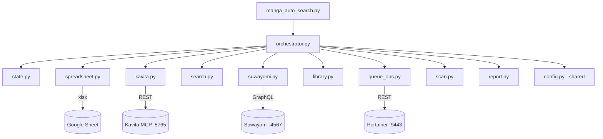

---

## 🧠 Module: `orchestrator.py` — The Brain

The only module that knows the full lifecycle. Composes all others into the per-title pipeline and tick loop.

### Key Responsibilities
- Kavita skip check (cache + manual list)
- Per-title: search → fetch → chapter probe → enqueue
- Internal retry (5 attempts) for chapter indexing lag
- Live tick budget enforcement
- Summary emission

### Per-Title Pipeline

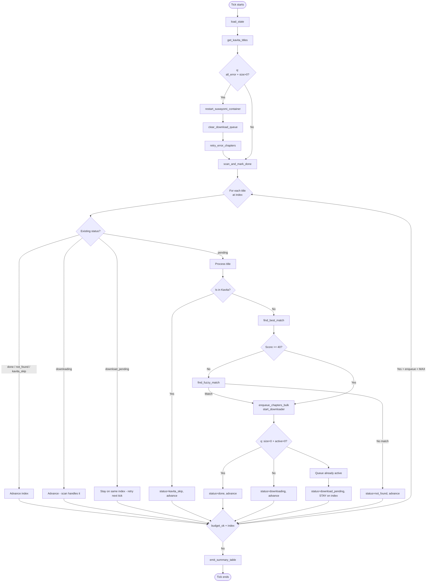

### Tick Budget Logic (Two-Layer)

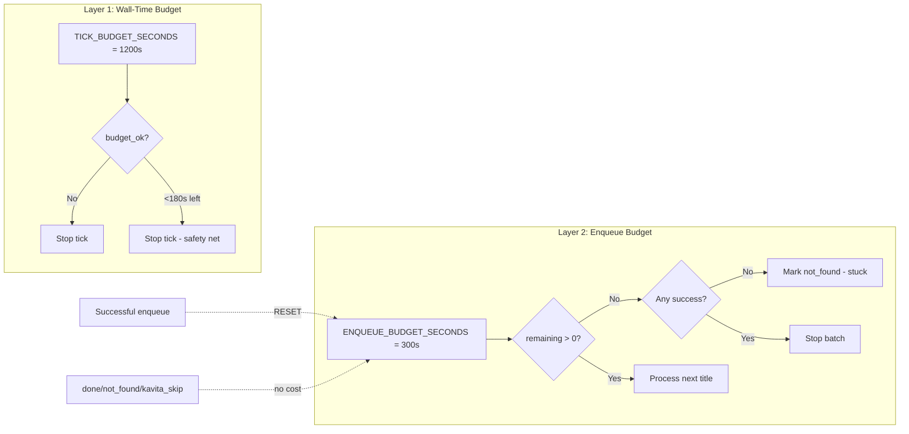

**Adaptive rules:**
- **Bookkeeping** (instant status checks, kavita skip) does **NOT** consume enqueue budget
- **Successful enqueue** (status=`downloading`) **RESETS** the enqueue budget → tick keeps searching
- **MAX_ENQUEUES_PER_TICK = 1** → stops after 1 successful enqueue (prevents Suwayomi overload)

---

## 🔍 Module: `search.py` — Variant Generation + Scoring

### What Happens
Generates smart search variants of titles (strip parens, JP→EN romanization hints), then scores candidates by keyword overlap, chapter count, and spinoff penalty.

### Variant Generation

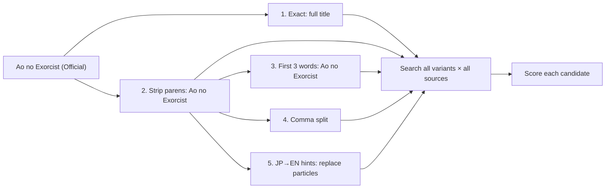

### Scoring Pipeline

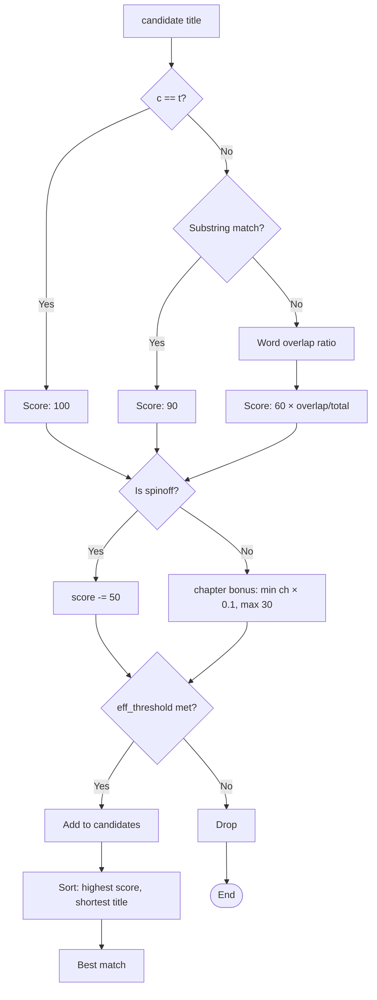

---

## 🔄 Module: `suwayomi.py` — GraphQL Client

Single point of contact with Suwayomi. All higher-level modules import from here.

### Function Categories

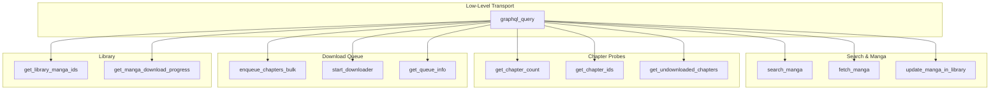

### GraphQL Pitfall
**MUST** wrap in JSON envelope: `json.dumps({"query": q}).encode()`. Raw query string → HTTP 400. Empty `errors[].message` is the symptom.

---

## 📚 Module: `kavita.py` — Skip Check + Fuzzy Match

### What Happens
Fetches Kavita library via MCP, normalizes all titles, and matches incoming titles using 5-tier fuzzy matching.

### 5-Tier Match Algorithm

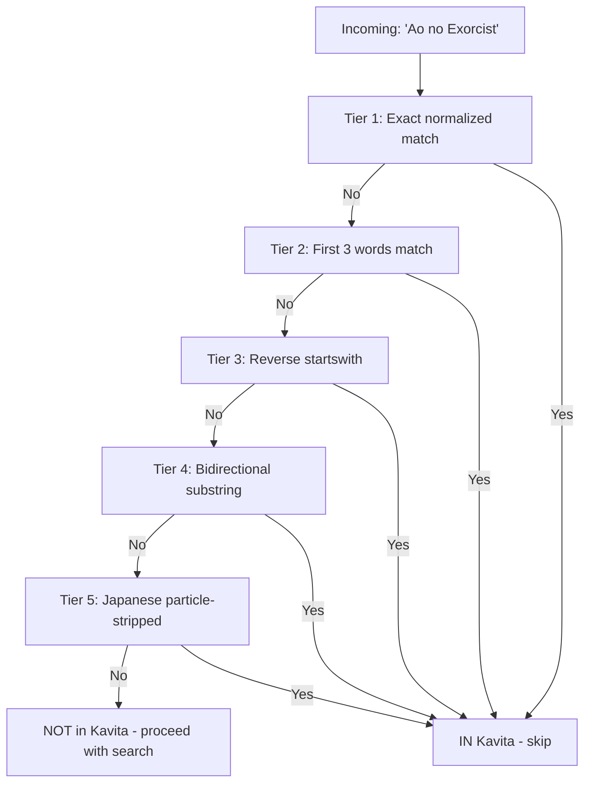

### Normalization Steps

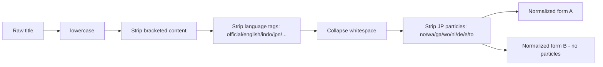

### Kavita Library Fetch

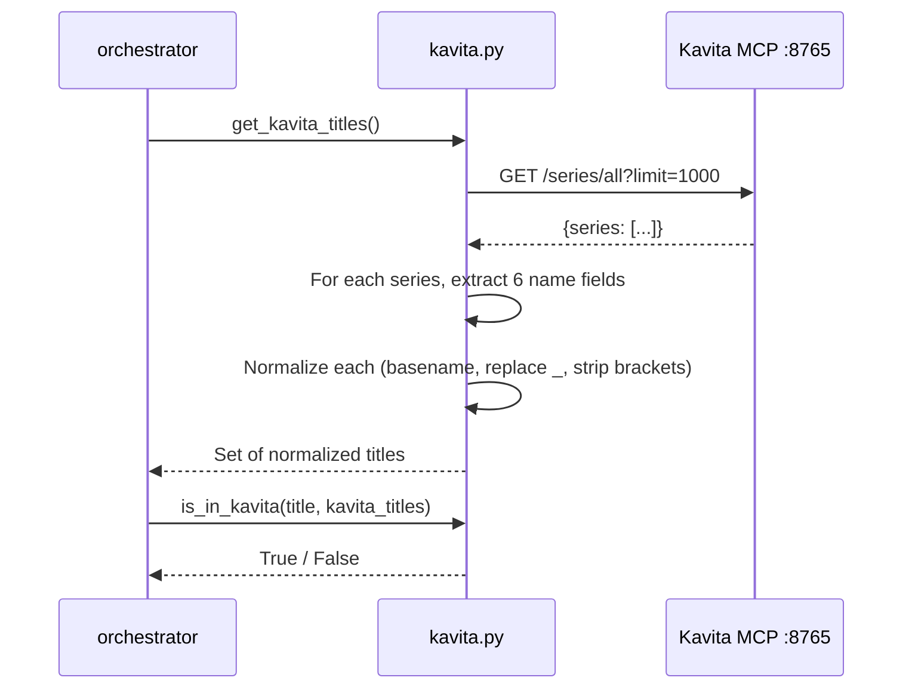

---

## 🔄 Module: `scan.py` — Scan-and-Mark-Done

### What Happens
Catches manga that finished downloading between ticks. Without this, the "downloading" status would pile up forever.

### Two-Pass Logic

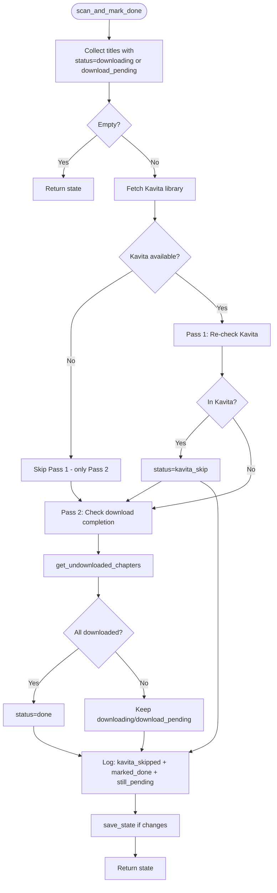

**Why both passes?** If Kavita API was down last tick, a title might have been wrongly marked `downloading`. Pass 1 catches that — if it's actually in Kavita, mark `kavita_skip` so it doesn't sit forever.

---

## 🛠️ Module: `queue_ops.py` — Recovery

### When It Runs
Only when `get_queue_info().all_error == True and queue_size > 0` — meaning the entire queue is deadlocked.

### Recovery Sequence

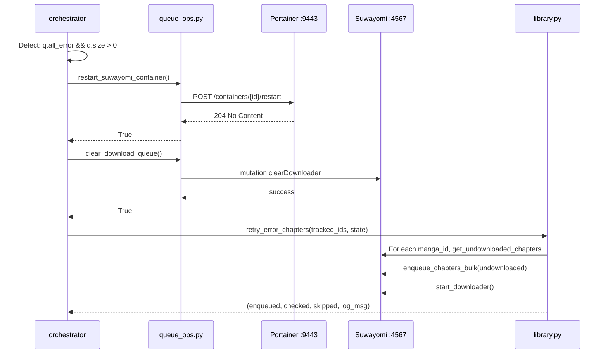

---

## 📊 Module: `report.py` — Tick Summary Table

### Output Format

```
==============================================================================
📊 MANGA AUTO-SEARCH TICK #42 — 2026-06-27 14:32:11
==============================================================================

| Status              | Count | Δ vs prev |
|---------------------|-------|-----------|
| ✅ done              |    17 |    +3 ✅  |
| 📥 downloading       |    18 |    +1 📥  |
| ⏳ download_pending  |     0 | (n/a)     |
| ❌ not_found         |    24 |    +2 ❌  |
| 📚 kavita_skip       |    41 |   +17 📚  |
| ⏳ pending           |     0 | (n/a)     |
| **total**           | **100** |             |

📍 Index: 42/100 (42%)

🆕 New since last tick:
   ✅ done: +3 | ❌ not_found: +2 | 📥 downloading: +1 | 📚 kavita_skip: +17

📝 Notes:
   • MAX_ENQUEUES_PER_TICK = 1 (Suwayomi overload protection)
   • Next tick resumes at #43
   • Already-downloading titles: 18 (preserved, not re-enqueued)
==============================================================================
```

---

## 💾 Module: `state.py` — Atomic Persistence

### What Happens
Reads/writes JSON state with atomic write (tmp + rename) to prevent corruption on crash.

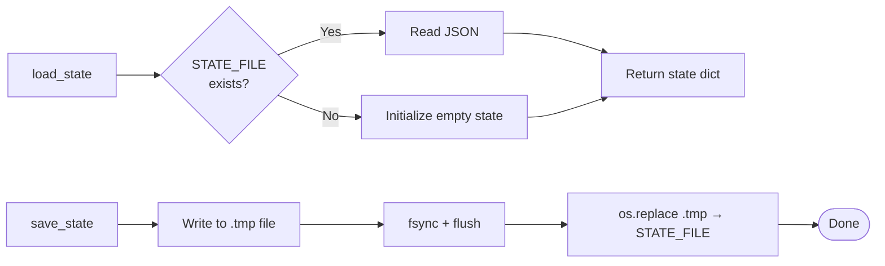

---

## ⚙️ Module: `config.py` — Constants

| Constant | Value | Purpose |
|----------|-------|---------|
| `SUWAYOMI_DIRECT` | `http://1.2.3.33:4567/api/graphql` | Suwayomi GraphQL endpoint |
| `KAVITA_MCP` | `http://1.2.3.131:8765` | Kavita MCP endpoint |
| `TICK_BUDGET_SECONDS` | `1200` (20 min) | Hard wall-time limit |
| `ENQUEUE_BUDGET_SECONDS` | `300` (5 min) | Network-I/O budget per batch |
| `MAX_ENQUEUES_PER_TICK` | `1` | Stop after 1 successful enqueue |
| `MAX_INTERNAL_RETRIES` | `5` | Per-title chapter-index retries |
| `RETRY_DELAY` | `5` | Seconds between retries |
| `MANUAL_KAVITA_SKIP` | `set(...)` | Fallback skip list when Kavita API down |
| `STOP_WORDS` | `set(...)` | Ignored in title matching |
| `SPINOFF_MARKERS` | `list(...)` | Heavily penalized in scoring |

---

## 🔄 Status Lifecycle

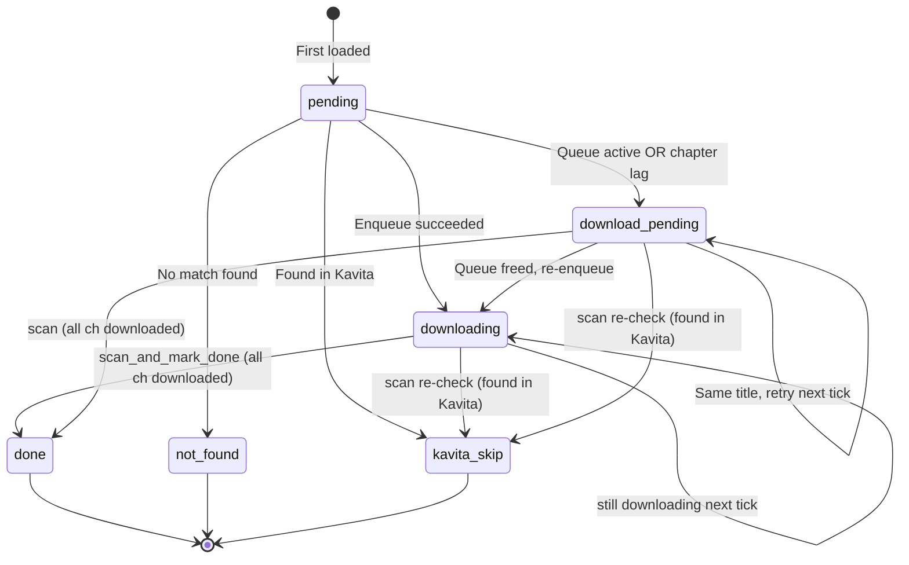

---

## 🐛 Debugging

### Check Current State
```bash
cat /config/.hermes_2/state/manga_search_state.json | python3 -m json.tool | head -30
```

### Check Last Tick Summary
```bash
cat /config/.hermes_2/state/manga_search_summary.json
```

### View Progress Log
```bash
tail -50 /config/.hermes_2/state/manga_search_progress.txt
```

### Manual Run
```bash
cd /config/.hermes_2/scripts
python3 manga_auto_search.py
```

---

## 📝 Push History (v2)

Each push below shows what was changed and why:

### Commit 95c5ba4 — fix: download_pending retry logic + kavita re-check in scan + improved fuzzy matching
**What happened:** User reported that Blue Exorcist was stuck in `downloading` queue forever, even though it was already in Kavita.

**Diagnosis:**
1. `save_and_advance()` was incrementing index for `download_pending` status → title never got re-checked next tick
2. `scan_and_mark_done()` only checked if chapters were downloaded, not if Kavita had it now
3. Fuzzy matching in `is_in_kavita()` couldn't handle "Ao no Exorcist" (JP) ↔ "Blue Exorcist" (EN)

**Fix:**
- `orchestrator.py`: `download_pending` no longer advances index → same title retries next tick
- `orchestrator.py`: `save_and_advance()` skips index increment when status=`download_pending`
- `orchestrator.py`: `process_title()` checks `get_queue_info()` BEFORE enqueue → if queue active, returns `download_pending` (prevents flooding Suwayomi)
- `scan.py`: Added Pass 1 (re-check Kavita) → if title now in Kavita, mark `kavita_skip`
- `kavita.py`: Added 5-tier fuzzy matching with Japanese particle stripping (handles "Ao no Exorcist" → "Ao Exorcist" → matches "Ao no Exorcist" in Kavita)

**Result:** Tick #27 successfully marked 17 stuck titles as `kavita_skip` and enqueued 1 new title.